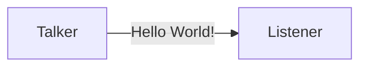
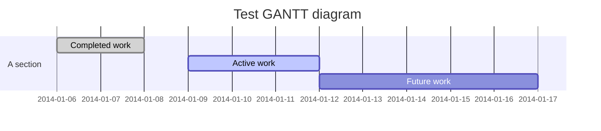
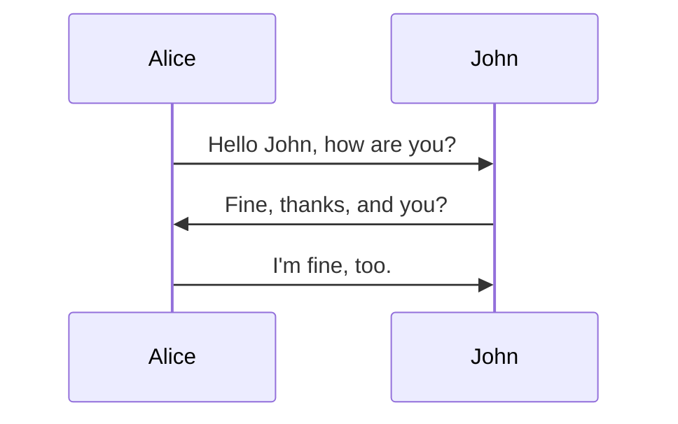

# Mermaid 示例
Merimaid 是一个简单的流程图生成工具，它语法简单，内嵌于markdown编辑器 Typora 中，下面是Mermaid 绘图的几个示例：流程图、甘特图和序列图。 

## 流程图



## 甘特图


## 序列图


# 配置Hexo

相信大家都很熟悉 Hexo 这款静态博客生成工具，目前 Hexo官方也提供了 Mermaid 的支持，只不过还没有写入默认配置，需要手动对配置文档进行修改，主要修改以下两处地方。

1. 在根目录下的 _config.ymal文件中添加

   ```yaml
   # mermaid chart
   mermaid: ## mermaid url https://github.com/knsv/mermaid
     enable: true  # default true
     version: "7.1.2" # default v7.1.2
     options:  # find more api options from https://github.com/knsv/mermaid/blob/master/src/mermaidAPI.js
       #startOnload: true  // default true
   ```

   

2. 修改对应主题的配置文件，从而激活js模块，以next为例，在themes/next/layout/_partials/footer.swig 中添加

   ```yaml
   
     <script src='https://unpkg.com/mermaid@{{ theme.mermaid.version }}/dist/mermaid.min.js'></script>
     <script>
       if (window.mermaid) {
         mermaid.initialize({theme: 'forest'});
       }
     </script>
   
   ```

   这样就可以将Typora中画好的图直接传到博客上进行解析

# 参考链接

1. [Hexo中引入Mermaid流程图](https://tyloafer.github.io/posts/7790/)
2. [GitHub:hexo-filter-mermaid-diagrams](https://github.com/webappdevelp/hexo-filter-mermaid-diagrams)
3. [mermaid GitBook](https://mermaidjs.github.io/)


