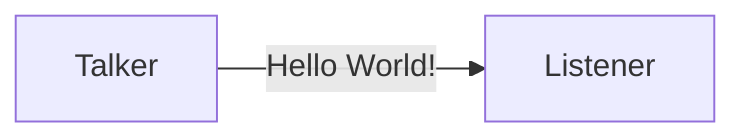
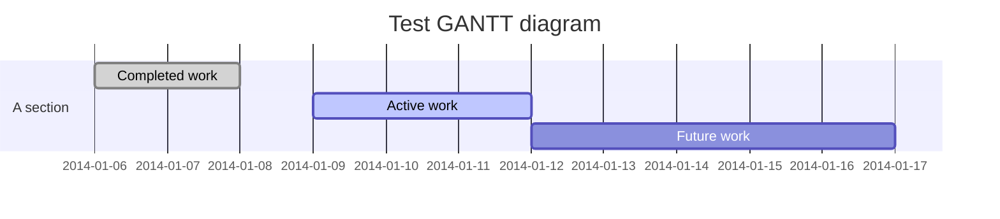
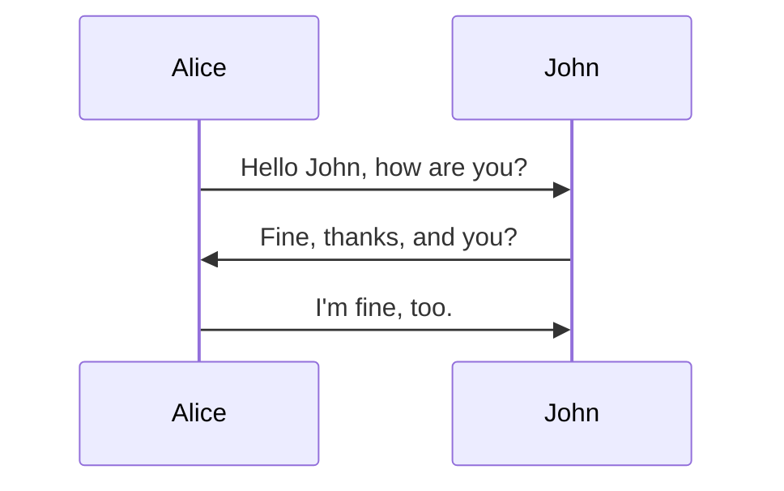

# Mermaid 示例
## 流程图

## 甘特图

## 序列图

# 参考链接
1. [Hexo中引入Mermaid流程图](https://tyloafer.github.io/posts/7790/)
2. [GitHub:hexo-filter-mermaid-diagrams](https://github.com/webappdevelp/hexo-filter-mermaid-diagrams)
3. [mermaid GitBook](https://mermaidjs.github.io/)

